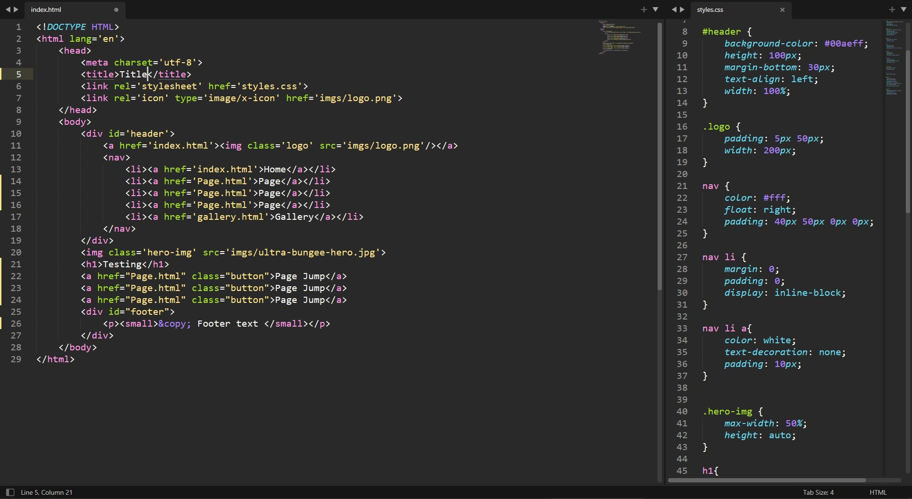
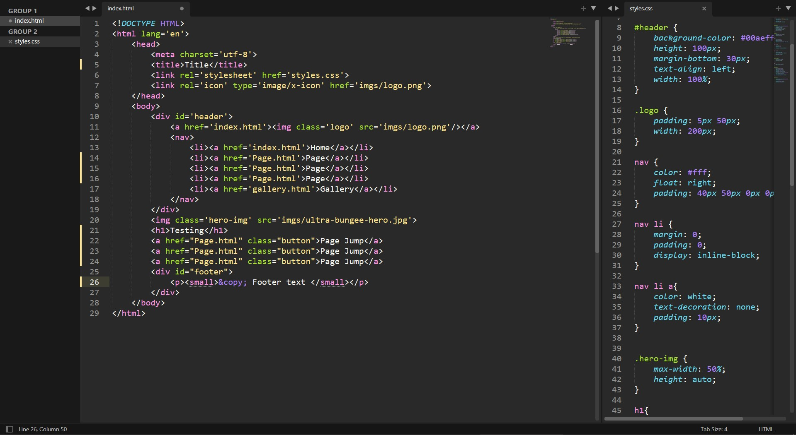

# Monokai Flat 
High contrast modification of Monokai colour scheme for Sublime Text 4 removing dark yellow background and adding lighter colours.

## Install instructions:
  1. Download and extract the folder.
  2. Copy the colour scheme file.
  3. Paste the file into your "C:\Users\ *username* \AppData\Roaming\Sublime Text 3\Packages\user" folder.
  4. Apply the color scheme in Sublime Text's menu: "Preferences/Select Color Scheme.../monokai-flat"
  5. Apply adaptive theme in preferences menu: "Preferences/Select Theme.../Adapitive"
  6. Enjoy the Color Scheme!!
